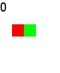
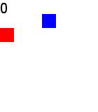
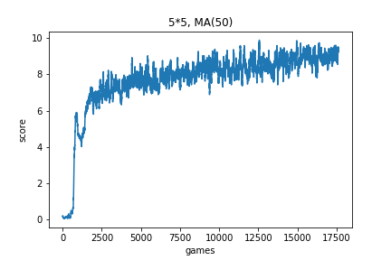
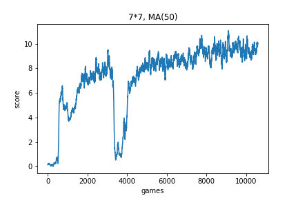
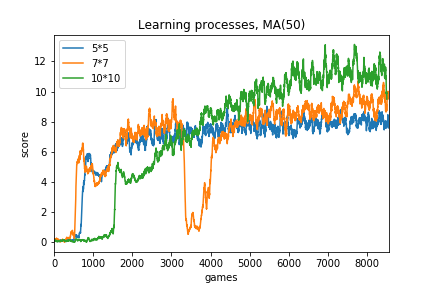

# Reinforcement Learning for the Snake Game

Some experiments of using reinforcement learning to solve the classic snake game. What is special about reinforcement learning is that you don't need to teach the program any rules or tricks about the game, but the program can learn how to play automatically. So it is kind of a simulation of human learning process.

A deep neural network is used to fit the Q function in Q learning. The inputs are the snake and the fruit's locations, and the outputs are the Q values for 4 actions (UP / DOWN / LEFT / RIGHT). 

I do not have a GPU, so I only tried some small size of game board (5\*5, 7\*7, 10\*10). In theory, this should work in any size, but a larger size may need more training and playing (for the program to see more states of the game and learn).

## Files

"main_train.py" is the file to run. It will use "snake_game.py", which is the simulation of the snake game. "train{m}_{n}.py" stores the hyper-parameters and the model structure for the {m}\*{n} size of game board. Each size's experiment result is stored in a corresponding folder. Each folder has a Jupyter notebook to see the score results.

"make_gif.py" is the codes to make the gif images.

## Results

### Videos 

|Board Size      | 5\*5                       | 7\*7                        | 10\*10                        |
| -------------- | -------------------------- | --------------------------- | ----------------------------- |
|Video           | |  |  |
|Games played    |  17655     |   10638         |        8553    |
|Max Score | 19 | 19| 24|

### Score plots

(MA(50) = Moving average 50)

(Also see *analyze_all.ipynb*)

Comparison:

### About 15\*15 and 20\*20

I also tried some experiments on 15\*15 and 20\*20 board sizes. But when the board size is such big, it is very tough for the program to find the rules in the beginning exploration. In limited time to let it to random walk, it hardly eat any fruit. (In my experiments, the max score is only 4 and 2.) So the positive reward samples are too few at the beginning, and it cannot learn any thing without those samples. Given more exploration time, it may work in bigger board sizes.

## Analysis

1. There are 3 phases for the program to learn the game. At first, the score is low, because it randomly walk on the board and don't know what to do to get points. Then, the score booms to a high level, because when it eat the fruit at some times, it learns to move toward the fruit. Finally, it improves slowly, to gradually learn any new tricks like detour at different kinds of complex situations. (There is a period of the 7\*7 experiment that the line suddenly goes down. I guess that may be caused by some overfitting. But that is not a problem, because new samples fixed it soon.) 

1. About detour. We know detour is the key to get higher scores. In the videos, the program often dies for wrong detour. Fortunately, we can see sometimes it does detour to avoid eating itself. I think that's what it learns during the gradually improvement period, and it will do better given more training.

1. In bigger board, it learns slower but finally get more points. Obviously, bigger board need more random walk to find something, but it is less likely to restrict the snake itself in part of the area without the fruit. 
