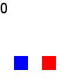
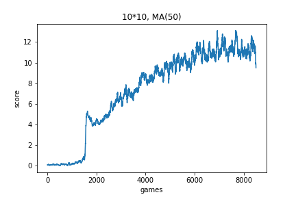

# Reinforcement Learning for the Snake Game

## Introduction

These are some experiments of using reinforcement learning to solve the classic Snake game. What is special about reinforcement learning is that you don't need to teach the program any rules or tricks about the game, but the program can learn how to play automatically. So it's a simulation for human learning process.

A deep neural network is used to fit the Q function in Q learning. The inputs are the locations of the snake and the fruit, and the outputs are the Q values for 4 actions (UP / DOWN / LEFT / RIGHT, if available). 

Since I don't have a GPU, I only tried some small sizes of game board. In theory, the same algorithm should work on any size, but a larger size may need much more training and playing (for the program to see more states, especially when it need to walk randomly tons of steps to eat a fruit by luck).

By the way, another game learning experiment for Wechat Jump Game is at: https://github.com/yanglyuxun/game_play_jump 

## Code Files

`main_train.py` is the file to run. It will use `snake_game.py`, which is the simulation of the snake game. `train{m}_{n}.py` stores the hyper-parameters and the model structure for the {m}\*{n} size of game board. Each size's experiment result is stored in a corresponding folder. Each folder has a Jupyter notebook to see the score results.

`make_gif.py` is the codes to make the gif images.

## Results 

|Board Size      | 5\*5                       | 7\*7                        | 10\*10                        |
| -------------- | -------------------------- | --------------------------- | ----------------------------- |
|Video           | |  |  |
|Games played    |  17655     |   10638         |        8553    |
|Max Score | 19 | 19| 24|

### Learning plots

(MA(50) = Moving average 50)

(Also see *analyze_all.ipynb*)

Comparison:

### About 15\*15 and 20\*20

There are also experiments on 15\*15 and 20\*20 board sizes. But when the board size is such big, it is very tough (especially without a GPU) for the program to find the rules in the initial explorations. In limited time to let it to random walk, it barely eats any fruit. (See the corresponding folders for details.) So the positive reward samples are too few at the beginning, and it cannot learn any thing without enough positive samples. Given more exploration time, it may work after having observed lots of positive states.

## Analysis

1. In the plots, there are 3 phases for the program to learn the game. At first, the score is low, because it randomly walks on the board and has no idea about how to get points. Then, the score suddenly booms to a higher level, because when it eat some fruits, it learns to try to move toward the fruit. Finally, it improves slowly, to gradually learn any new tricks like detour at different kinds of complex situations. (There is a period of the 7\*7 experiment that the line suddenly goes down. I think that was caused by overfitting. But that was not a problem, because new samples fixed it soon.) 

1. About detour. We know detour is the key to get higher scores. In the videos, the program often dies for wrong detour. Fortunately, we can see sometimes it does detour to avoid eating itself. I think that's what it learns during the gradually improvement period, and it will do better given more training. Increasing the punish of eating itself will help it to learn detouring faster, but may reduce the speed of moving toward the fruit.

1. In bigger boards, the program improves slower, but ultimately gets more points. Obviously, bigger board need more random walk to find some rules, but it is less likely to restrict the snake itself in a small area and eat itself. 
